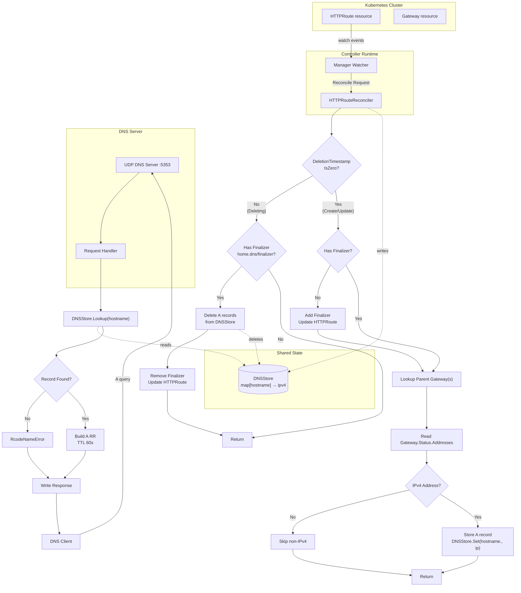

# HTTPRoute DNS Reconciler Architecture

> Flow of the HTTPRoute DNS reconciler showing how Kubernetes HTTPRoute events are translated into in-memory DNS A records served by a UDP DNS server.

---
*Generated on 2026-09-19 · diagram type: `flowchart`*
